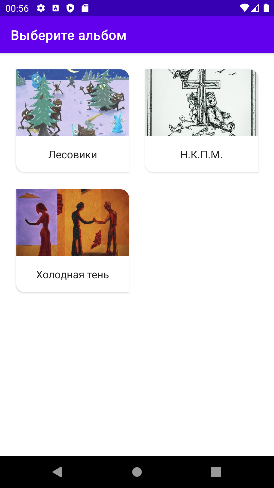
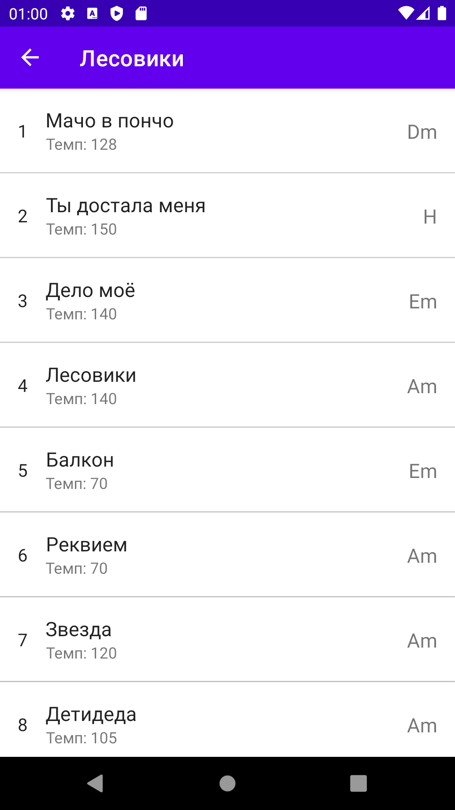
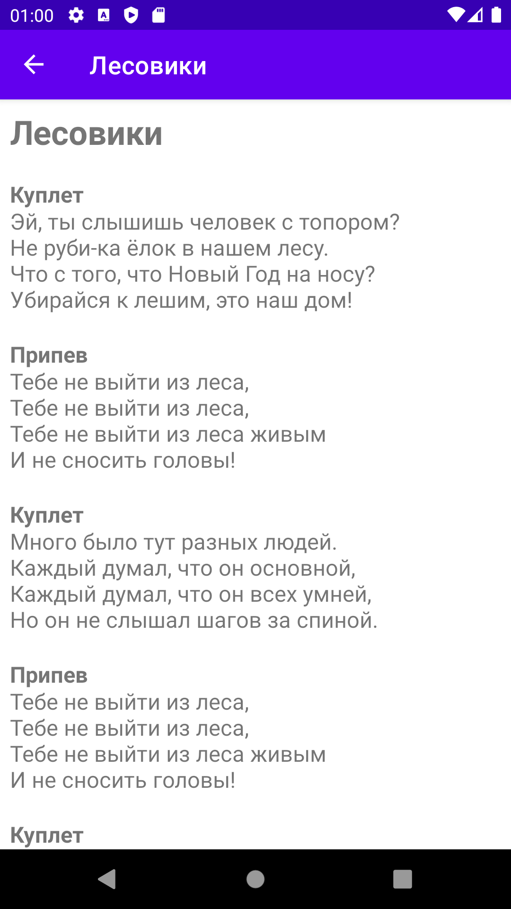

# detideda-songbook

This simple Android application is a collection of songs by the rock band [Detideda](https://detideda.ru) :guitar:

## Screenshots

Albums | Songs | Song Detail
------ | ----- | -----------
 |  | 

## Tech Stack

- Clean Architecture

- Single Activity Application

- MVVM (Model-View-ViewModel)

- Kotlin

- Coroutines Flow

- Room

- Hilt

- View Binding

- Navigation Component

- Glide

- Material Design & Transitions
